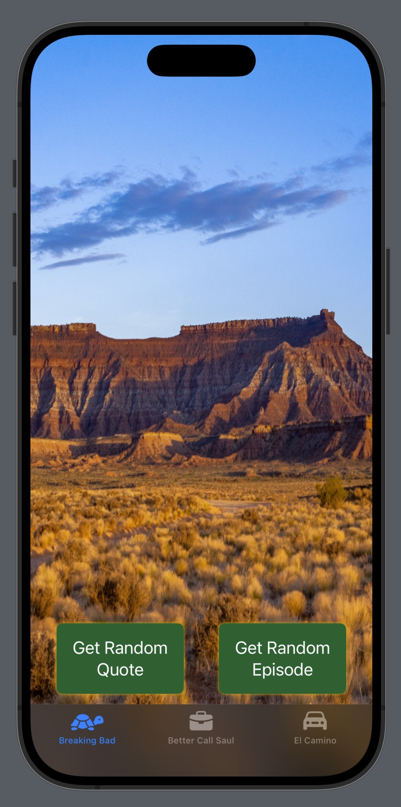
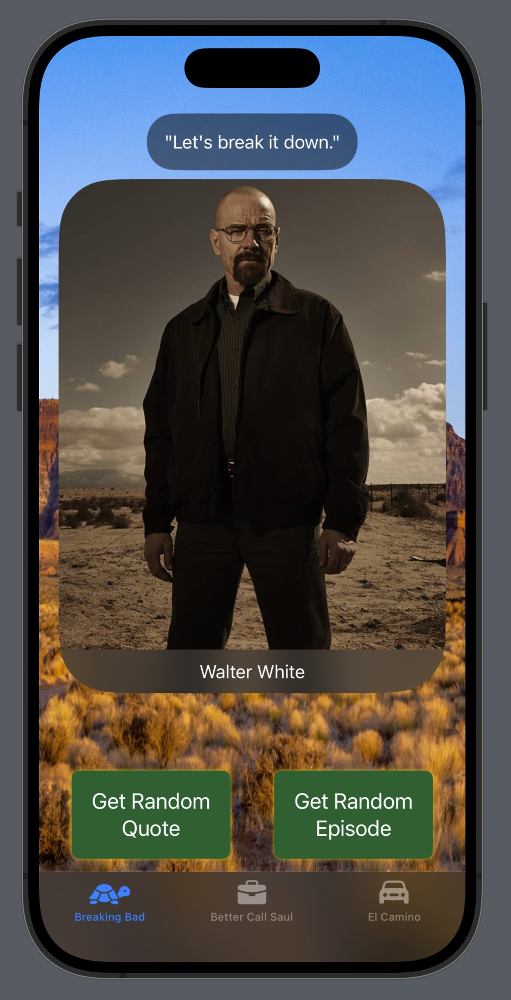
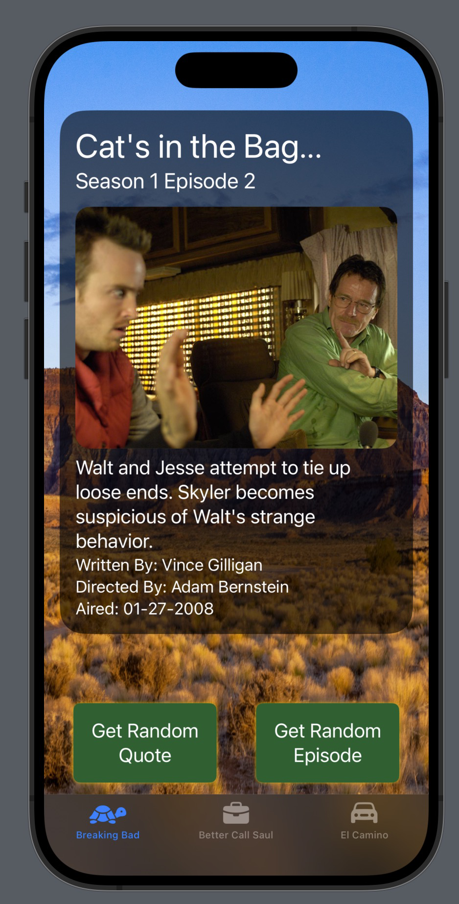

# BB Quotes

**BB Quotes** é um aplicativo desenvolvido em SwiftUI que permite aos usuários obter citações aleatórias, informações sobre personagens e episódios de séries populares, como *Breaking Bad* e *Better Call Saul*. O aplicativo foi criado para fornecer uma experiência imersiva com um design escuro e elementos visuais atraentes.

## Funcionalidades

- **Citações Aleatórias**: Obtenha citações aleatórias de personagens das séries *Breaking Bad* e *Better Call Saul*.
- **Informações dos Personagens**: Toque na imagem de um personagem para visualizar detalhes como ocupações, apelidos, status e mais.
- **Episódios Aleatórios**: Receba informações detalhadas sobre episódios aleatórios das séries, incluindo título, sinopse, data de exibição, entre outros.
- **Modo Noturno**: O aplicativo opera exclusivamente no modo noturno para proporcionar uma experiência visual mais confortável.

## Pré-requisitos

Antes de começar, certifique-se de ter o seguinte instalado:

- **Xcode 14.0** ou superior
- **iOS 16.0** ou superior
- **Swift 5.7** ou superior

## Como Executar

1. **Clone o repositório**:
    ```bash
    git clone https://github.com/seuusuario/bb-quotes.git
    ```

2. **Abra o projeto no Xcode**:
    ```bash
    cd bb-quotes
    open BBQuotes.xcodeproj
    ```

3. **Execute o projeto**:
    - Selecione o simulador ou dispositivo físico desejado no Xcode.
    - Pressione `Cmd + R` para compilar e executar o aplicativo.
  





